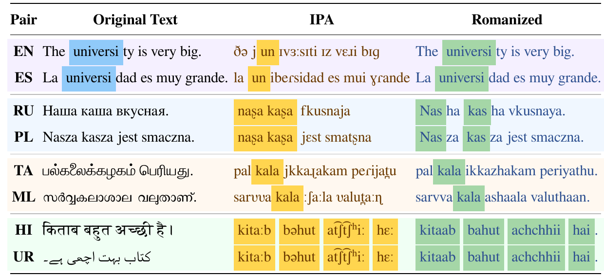

# One Form to Transfer Them All: Pretraining Multilingual Language Models Beyond Native Orthography

Official code for [One Form to Transfer Them All: Pretraining Multilingual Language Models Beyond Native Orthography](https://arxiv.org/abs/2608.25904).



## Setup

```bash
pip install -r requirements.txt
sudo apt install espeak-ng   # for data/transcribe.py
```

## Data

```bash
# Add <column>_ipa_stripped and <column>_romanized columns.
python data/transcribe.py --dataset data/corpus_raw --columns text --language-column language --output data/corpus
python data/transcribe.py --dataset csebuetnlp/xlsum --config tamil --columns text summary --language ta --output data/xlsum/tamil

# Tokenizer and training shards for one representation.
python data/train_tokenizer.py --datasets data/corpus --column text_ipa_stripped --vocab-size $VOCAB --output tokenizers/ipa.json
python data/build_bins.py --datasets data/corpus --column text_ipa_stripped --tokenizer tokenizers/ipa.json \
    --output bins/ipa --shard-size $SHARD --seed $SEED
```

## Pretraining

```bash
torchrun --nproc-per-node=$GPUS pretrain/train.py --size medium \
    --train-files 'bins/ipa/data_train_*.bin' --val-files 'bins/ipa/data_val_*.bin' --tokenizer tokenizers/ipa.json \
    --epochs $EPOCHS --tokens-per-step $TOKENS --seq-len $SEQ \
    --muon-lr $LR --muon-momentum $MOMENTUM --adam-betas $B1 $B2 --cooldown-frac $COOLDOWN \
    --val-every $VAL_EVERY --val-tokens $VAL_TOKENS --checkpoint-every $CKPT_EVERY --output runs/ipa-medium

# Resume; --keep-every N keeps intermediate checkpoints.
torchrun ... --resume runs/ipa-medium/last.pt
```

## Prompting

```bash
python eval/icl.py --task xstorycloze --language hi --representation ipa \
    --checkpoint runs/ipa-medium/best.pt --tokenizer tokenizers/ipa.json \
    --k $K --reduce sum --subsample $N --seed $SEED --output results/xstorycloze_hi_ipa.json

# Text-pretrained model on romanized inputs.
python eval/icl.py ... --representation romanized --checkpoint runs/text-medium/best.pt --tokenizer tokenizers/text.json
```

## Fine-tuning

```bash
python eval/finetune_classification.py --task massive --representation ipa --languages en es hi \
    --checkpoint runs/ipa-medium/best.pt --tokenizer tokenizers/ipa.json \
    --lr $LR --batch-size $BS --epochs $EPOCHS --warmup-ratio $WARMUP --max-length $LEN --seed $SEED --output runs/massive-ipa

# Fine-tune, then generate and score with ROUGE.
python eval/finetune_summarization.py train --dataset data/xlsum --languages tamil --representation ipa \
    --checkpoint runs/ipa-medium/best.pt --tokenizer tokenizers/ipa.json --max-length $LEN --max-target-tokens $TARGET \
    --lr $LR --batch-size $BS --epochs $EPOCHS --warmup-ratio $WARMUP --seed $SEED --output runs/xlsum-ipa
python eval/finetune_summarization.py generate --dataset data/xlsum --languages tamil --representation ipa \
    --checkpoint runs/xlsum-ipa/best.pt --max-length $LEN --num-beams $BEAMS --max-new-tokens $NEW --output runs/xlsum-ipa
```

## Contact

zhang.16414@osu.edu

## Cite

```bibtex
@misc{zhang2026formtransferallpretraining,
      title={One Form to Transfer Them All: Pretraining Multilingual Language Models Beyond Native Orthography}, 
      author={Muge Zhang and Aaron Jencks and Krishna Badikela and Yulia Tsvetkov and Sachin Kumar},
      year={2026},
      eprint={2608.25904},
      archivePrefix={arXiv},
      primaryClass={cs.CL},
      url={https://arxiv.org/abs/2608.25904}, 
}
```
